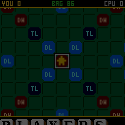
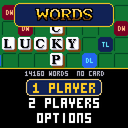
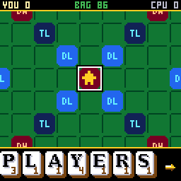
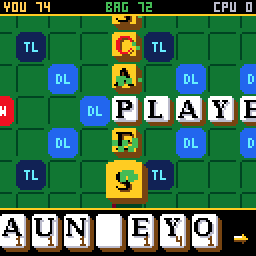
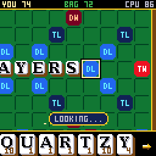
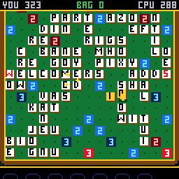

# CHWords

**WORDS**: a crossword tile game for the
[CHGame](https://github.com/bateske/CH32SerialBoot) handheld, in the casino
style of [CHBlackjack](https://github.com/bateske/CHBlackjack). Play the
classic fifteen-by-fifteen board against three CPU opponents or a friend.
14,160 words are built in, and a microSD card with the file `WORDS.DIC` on it
brings that to all 168,551 words of the ENABLE list.

## How to install

There are two parts: the **dictionary file**, which goes on a microSD card,
and the **game**, which goes onto the CHGame over USB. The card is optional:
without it the game plays with the 14,160 words built into it. With it,
every word you play is checked against all 168,551 words.

### Step 1: put the dictionary on a microSD card

1. **Download [`WORDS.DIC`](https://github.com/bateske/CHWords/raw/main/sdcard/WORDS.DIC)**
   (4 MB). It is the file in this repository's [`sdcard`](sdcard) folder.
2. **Use a microSD card formatted FAT32** (FAT16 works too). Cards of
   32 GB or less come formatted that way, so a new one is ready as it is.
   Cards of 64 GB and more come as exFAT, which the game cannot read: reformat
   such a card as FAT32 first (or use a smaller card).
3. **Copy `WORDS.DIC` to the top level of the card**, not into a folder,
   and keep its name exactly `WORDS.DIC`. The card should look like this:

       SD card
       └── WORDS.DIC

4. **Put the card in the CHGame's slot and switch it on.** The title screen
   says **168551 WORDS ON THE CARD** when it has found the file, and
   **14160 WORDS  NO CARD** when it has not. (A card put in later is found
   the next time the title screen comes up.)

### Step 2: put the game on the CHGame

1. Install the **Arduino IDE 2.x** from <https://www.arduino.cc/en/software>.
2. Add the **CHGame board package** (0.2.4 or later). In *File > Preferences*,
   paste this into *Additional boards manager URLs*:

       https://github.com/bateske/CH32SerialBoot/releases/latest/download/package_chgame_index.json

   Then open *Tools > Board > Boards Manager*, search for **CHGame** and click
   *Install*.
3. Add the **CHGfx library** (1.3.0). On <https://github.com/bateske/CHGfx>
   click *Code > Download ZIP*. Then in the IDE choose *Sketch > Include
   Library > Add .ZIP Library...* and pick the zip you downloaded.
4. **Download this game.** At the top of this page click *Code > Download
   ZIP* and unzip it. **Rename the folder from `CHWords-main` to `CHWords`**:
   the Arduino IDE only opens a sketch whose folder has the same name as its
   `.ino` file.
5. Open `CHWords/CHWords.ino` in the IDE and set:
   - *Tools > Board*: **CHGame**
   - *Tools > Optimize*: **Smallest + LTO**. The game does not fit without it.
   - *Tools > USB*: **Upload only**
   - *Tools > Port*: the CHGame's port
6. Plug the CHGame in by USB and click **Upload** (the arrow button).

The same from the command line:

    arduino-cli compile -b CHGame:ch32v:CHGame:opt=oslto,rtlib=nano,periph=game,usb=uploadonly CHWords
    arduino-cli upload  -b CHGame:ch32v:CHGame -p COMx CHWords

That is 50.4 KB of the 50,944-byte program area. The last two flash pages are left for your saved game.

## About the game

A crossword tile game for the [CHGame](https://github.com/bateske/CH32SerialBoot)
handheld (CH32X035 RISC-V, 128x128 colour LCD, piezo, microSD), in the casino
of [CHBlackjack](https://github.com/bateske/CHBlackjack) and its tables: the
classic fifteen-by-fifteen board in a wooden frame, a camera that plays
close up - ivory tiles standing up off the felt, their letters in a serif
face, the premium squares set into the board and labelled - and whips out
to the whole board while the CPU thinks or while you hold B, then back in to
watch the CPU's tiles drop onto it one by one. Your tiles slam down, a word
lights up a tile at a time, each a note up the scale, and pays out in a
float of gold; TRIPLE! shakes the table and BINGO! goes off in the rainbow
for all seven tiles. Three CPU opponents, two players passing the handheld
behind a curtain, and a hint when you are stuck.

The point of it is the dictionary. **14,160 words live in the game itself**,
in 12.4 KB of a 50 KB program, so it plays with nothing in the card slot;
put the file `WORDS.DIC` on a microSD card and your words are checked
against **all 168,551 words** of the ENABLE list (2 to 15 letters) instead.

| Title | A bingo | The CPU's reply |
|---|---|---|
|  |  |  |
| **A hint** | **The end of a game** | |
|  |  | |

(Captured from the PC simulator in `tools/chsim`, which runs the real game
and graphics code and renders what the device shows. **The game has been
built and checked in the simulator only.** On the handheld itself nothing
has been run yet: the SD card reader, the CPU's thinking time and the frame
times are still to be tried there.)

## Playing

| Button | On the board | At the rack | Elsewhere |
|---|---|---|---|
| D-pad | move over the squares | left/right: choose a tile; up: turn the word across/down; down: shuffle the rack | menus |
| A | on an empty square: go to the rack; on a tile you laid: take it back | lay the tile, and move on to the next square | select |
| B | tap: take your last tile back; hold: the whole board | back to the board | back |
| START | the menu: PLAY, SWAP TILES, PASS, SAVE+QUIT | the same | |
| SELECT | a hint: the best play the built-in list has, laid out for you | | |

The rules are the ones you know. The first word crosses the centre star;
every later play joins the tiles already down, all its tiles in one row or
column, and every word it makes, across and down, must be a word. Letters
score their face value, doubled or tripled on the blue and navy squares
(DL, TL); the wine and red squares (DW, TW) double and triple the whole
word. A
premium square counts once, for the play that covers it. All seven tiles in
one play earn 50 more. A blank stands for any letter and scores nothing.
The game ends when the bag is empty and someone plays their last tile (they
collect what is left on the other rack), or after six turns in a row
without a score.

**Laying a word.** Move to the square where the word starts and press A:
the glove goes to your rack. Choose a tile and press A; it lands on the
board and the cursor moves on to the next empty square (past tiles already
there), so a word is A, A, A. UP turns the direction between RIGHT and DOWN.
A blank asks which letter it is. Beside the rack is what the tiles so far
would score, or `--` while they do not make a legal play. START, then A on
PLAY, plays it. If a word is not in the list the tiles shake, the word
flashes red, and they stay where they are for you to change: nothing is
lost but your pride.

**The board** is shown close up while you play: eight columns and six rows,
the camera following the cursor (and keeping the first tile of the word you
are laying in view). Hold B to see the whole board; let go to come back. The
premium squares are set into the board, blue for the letter premiums (DL,
TL) and red for the word premiums (DW, TW); from far off they show just
"2" or "3". Tiles you are laying are grey and blue, like the dark pieces of
the chess set, and held up off the board; the last play made stays gold
until the next.

**Which words count.** With the card in, any ENABLE word. Without it, the
14,160 in the game: every two- and three-letter word, the most common
longer ones (up to eight letters), and the words that plain endings make
from those (walk, walks, walked, walking, walker, walkers). The CPU only
ever plays words from the built-in list, so it never plays a word the card
would refuse, and the hint shows only those too. Two players without a card
can agree to ALLOW a word the built-in list has not got. If the card is
pulled out in mid-game, the game says so and carries on with the built-in
list.

Against the CPU, choose one of three opponents:

| Opponent | |
|---|---|
| TOURIST | short words, and it knows about a third of them |
| REGULAR | knows most words, up to seven letters |
| HIGH ROLLER | every word in the list, the highest score, and it holds on to a blank or an S until they are worth playing |

The bag is the same for everyone: shuffled by one generator, seeded from the
moment you press the button, that the CPU cannot see into. Your record
against each opponent, your best game and your best single play are on the
opponent screen (hold SELECT there to clear the record). Options: sound,
the felt (green, blue, red, purple), and WORDS: how many words are built
in, and what to put on a card for the rest (with a card in: a random word
off it, dancing in the rainbow). Options, records and a game in progress
(SAVE+QUIT, then CONTINUE) are saved to flash and survive re-uploading.

## How it fits

* **The built-in dictionary** (`src/dict/FlashDict.cpp`, built by
  `tools/dict/build_dict.py`) costs three quarters of a byte a word. Three
  things get it there:
  * *Folding.* A word that a rule makes from another ("add S", "add ED",
    "drop the E and add ING", "change the Y to IES": 24 rules) is not
    stored; the base word carries the set of rules that make words from it.
    14,160 words are 4,535 entries.
  * *Front coding.* The entries are sorted, and each stores only the count
    of letters it shares with the one before, then the rest.
  * *Huffman coding by context.* Every symbol is Huffman coded with a table
    chosen by the letter before it (after Q, a U costs a fraction of a
    bit), and a word's last symbol names its rule set.

  A word graph (a DAWG), the usual structure for this game, measured 2.7
  bytes a word on the same list: it would have held a third as many
  (`tools/dict/measure.py` prints the comparison).
* **The CPU** (`src/ai`) cannot walk that list letter by letter the way a
  word graph is walked, so its search is turned around: it reads the whole
  list twice a turn. The first pass finds, for every empty square beside a
  tile, which letters would make a word with the tiles across it. The
  second tries every word everywhere it could go: a word needing letters
  the rack has not got must run through them on the board, which leaves few
  places. It thinks a slice at a time, so the screen keeps moving.
* **The card's dictionary** (`src/dict/Dict.cpp`, built by
  `tools/dict/build_sd.py`) is a hash table of 512-byte blocks: a word is
  one block read, with no index in RAM. The card is read with a small
  read-only driver (`src/sd`: CHSd, shared with CHCrossword and
  CHWordWheel, from HypeRunner) that borrows the display's SPI between
  frames and hands it back as it found it.
* **The tiles are drawn, not stored**: rounded rectangles in two colours
  (the face and its thickness) and a letter - close up and in the rack in a
  serif face anti-aliased with one in-between tone, as in CHCrossword
  (DejaVu Serif Bold, 546 bytes for all 26; the options menu uses it too),
  far off in the 3x5
  font. The board is drawn at any square size from 8 to 16 pixels, which is
  what lets the camera whip between them. The only stored art is the glove
  (CHChess's), the arrow for the way a word runs and the display font.
* **Flash** (release build): 50,416 of 50,944 bytes, of which the dictionary
  is 10,885. The camera, the raised tiles and the serif letters cost about
  3 KB, which is about 4,000 words of the built-in list; with a card in it
  makes no difference. **RAM**: 15.7 KB of 18.4 KB static, of which 8 KB is
  the framebuffer.

## Development

    python tools/check.py            # host tests, every script in the simulator (twice), the device build
    python tools/tests/run_tests.py  # the host tests alone
    python tools/chsim/chdrive.py --sim . tools/scripts/ui.txt out/ui    # one script: screenshots in out/ui
    python tools/chsim/chdrive.py --sim . tools/scripts/gameplay.txt out/gameplay   # the reel at the top (showcase.txt: the rest)
    python tools/dict/build_dict.py --bytes 10898    # rebuild the built-in list to a flash budget
    python tools/dict/build_sd.py    # sdcard/WORDS.DIC, checked word by word
    python tools/assets.py           # the glove, the arrow, the fonts -> src/assets

The simulator needs a C++ compiler (`CHSIM_CXX`, zig, clang++ or g++; see
`tools/chsim/chsim.py`). Set `CHWD_CARD=sdcard/WORDS.DIC` to give it a card (the simulator puts the
file on a pretend FAT16 card, so the FAT code runs too).
The word lists are downloaded on first use to `tools/dict/data/`
(`tools/dict/wordlist.py`).

The host tests check every word of the built-in list both ways (found by
lookup, given once by the scan), about 200,000 near misses and the
rest of ENABLE (not found), the rules against a second implementation, and
600 games between two CPUs in which every play is checked the plain way:
legal, scored right, every word it makes in the list, the tiles from the
rack, a hundred tiles in all.

After changing the code, see how much room is left
(`python tools/device.py build`) and give it to the dictionary: the image
must stay at or under 50,432 bytes to keep both save pages.

## License

Apache-2.0 (see `LICENSE`), with MIT-licensed parts and the word list's
credits in `NOTICE`.
